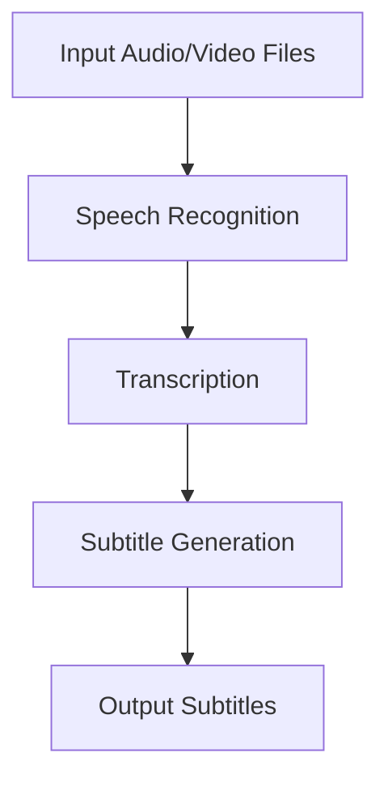
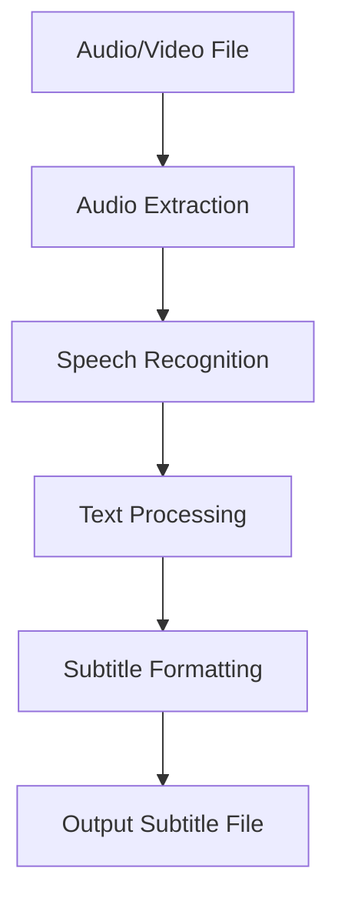

# Audio Video Subtitle Generator

## Overview
The Audio Video Subtitle Generator is a tool designed to generate subtitles for audio and video files. It uses advanced speech recognition technology to transcribe the audio and generate subtitles in various formats.

## Installation
To install the project, follow these steps:
1. Clone the repository: `git clone https://github.com/Priyanshuthapliyal2005/audio-video-subtitile-generator.git`
2. Navigate to the project directory: `cd audio-video-subtitile-generator`
3. Build the Docker image: `docker build -t audio-video-subtitle-generator .`
4. Run the Docker container: `docker run -it audio-video-subtitle-generator`

## Usage
To use the project, follow these steps:
1. Place your audio or video files in the `input` directory.
2. Run the subtitle generation script: `python generate_subtitles.py`
3. The generated subtitles will be saved in the `output` directory.

## Contribution
We welcome contributions to the project. To contribute, follow these steps:
1. Fork the repository.
2. Create a new branch: `git checkout -b my-feature-branch`
3. Make your changes and commit them: `git commit -m 'Add new feature'`
4. Push to the branch: `git push origin my-feature-branch`
5. Create a pull request.

## Workflow
The workflow for generating audio, video, and subtitles is as follows:
1. Input audio or video files are placed in the `input` directory.
2. The `generate_subtitles.py` script is run to transcribe the audio and generate subtitles.
3. The generated subtitles are saved in the `output` directory.

## High-Level Design (HLD)

## Low-Level Design (LLD)

## Basic Architecture
The basic architecture of the Audio Video Subtitle Generator consists of the following components:
1. **Audio/Video Input**: The input audio or video files that need to be transcribed.
2. **Speech Recognition**: The component that processes the audio and converts it into text.
3. **Transcription**: The process of converting the recognized speech into text.
4. **Subtitle Generation**: The process of formatting the transcribed text into subtitle files.
5. **Output Subtitles**: The generated subtitle files in various formats.
